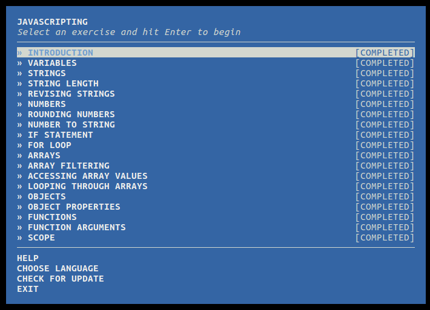

# Javascripting WORKSHOP

Durante el **WORKSHOP** pasamos un repaso breve sobre lo que vimos en el curso de Javascript en **CODECADEMY**,
el cual resulto muy interesante en base a los ejecicios que en el nos plantean, afirmamos los conocimientos en temas como :

**variables, funciones, for, arrays y muchas cosas mas.**

El contenido muy bien explicado, ciertas cosas confusas debido a que todo el material viene en ingles.

Javascript es un lenguaje muy practico y me gustaria aprender mas de el... y no solo saber como funciona, si no como resolver problemas que los desarrolladores se topan dia a dia.

### Cuantos pomodores me tomo concluir el workshop?

3 promodoros ya que el conocimiento en JS esta fresco lo cual te permite facilidad en resolver los pequenos problemas que en el workshop se plantean.

### Que temas son con los que mas luche?

**Scope** ya que sera esencial saber en que ambito estoy trabajando a la hra de requerir una variable.

**Ciclos While** deplano en estos me perdi por momentos por completo.

**Funciones 'Callbacks'** aun no entiendo al 100% como se manejan y en la busca por ver que hacen me confundo un poco.

### Que es npm?

Es por default el manejador de paquetes de javascript que corre en el enviroment **node.js.**

### Para que usamos "alias js=javascripting"?

Lo utilizamos como shurtcut para acceder al workshop sin con solo escribir 'js' desde la terminal y no escribir 'javascripting'
  **ESO ESTA CHIDO!.**
